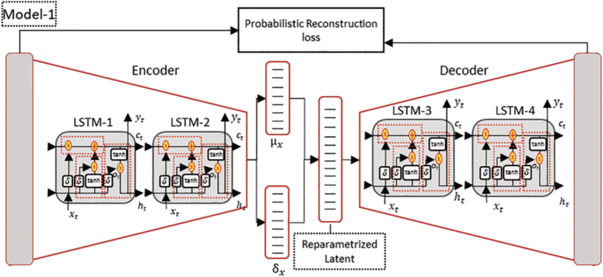
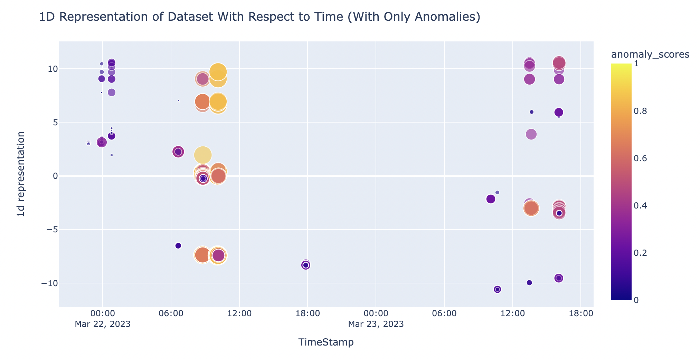

# Anomaly Detection For Semiconductor Wafers

### Objective
The main object is to detect anomalies from the production of semiconductor wafers.

### Dataset
The dataset contains multivariate time series data from tool sensors. It also contains no labels, thus this is an unsupervised learning problem. Feature names have been anonymized.

### Data Preprocessing & Feature Engineering Pipeline
Pipeline 0
* Handle Missing Data (Little’s MCAR Test)

Pipeline 1
* Drop timestamp columns (we will use the sequence of the data as the temporal feature, not the timestamp)
* Standard scaler (subtract mean and divide by standard deviation)
* One Hot Encoding

Feature Selection & Filter Pipeline
* Isolation Forest model to select the top 15 most important features

Pipeline 2
* Convert pandas dataframe to PyTorch Tensor
* Create sequences using a sliding window (sequence length = length of run)
* Create PyTorch DataLoader

### Model Selection
LSTM VariationalAutoEncoder
<picture>
  
</picture>
* LSTMs capture long-term dependencies in data sequences 
* Autoencoders are trained on normal data, learning to reconstruct these inputs accurately. When an anomalous input is presented, the autoencoder struggles to reconstruct it, leading to a higher reconstruction error. This error is then used as a signal to detect anomalies.
* The Variational part of the model represents the latent space, which encourages more meaningful and smooth representations. This can lead to better generalization and robustness in generating and reconstructing data.

* Optimizer: Adam
* Loss Function: Reconstruction Error

### Anomaly Detection
Datapoints are flagged as anomalous if its reconstruction error is above the threshold defined below:

threshold = μRE + 3σRE

where:
* 𝜇RE represents the mean of the reconstruction errors
* 𝜎RE represents the standard deviation of the reconstruction errors

### Deployment
The demo may be deployed with Streamlit as contained in the prod folder.
<picture>
  
</picture>

